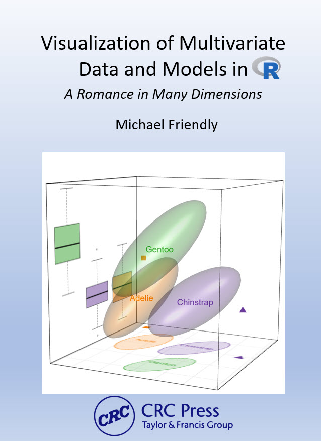

# *Visualizing Multivariate Data and Models in R* 

This is the main repository for my book, _Visualizing Multivariate Data and Models in R_, to be published by Chapman & Hall, CRC press.

This book is about graphical methods for multivariate data, and their uses in understanding relationships
particularly when there are several aspects to be considered together in multiple response models
such as multivariate analysis of variance and multivariate multiple regression.

## Features
Some key substantive features of the book are:

* Statistical data visualization is cast in a general framework by goal (see the data, visualize a model, diagnose problems), rather than a categorization by graphic types. It is best informed by principles and goals
of communication, for example making graphic comparison easy and ordering factors and variables according to what should be seen (_effect ordering_).

*	Data visualization is seen as a combination of **exposure**---plotting the raw data---and **summarization**--- plotting statistical summaries---to highlight what should be noticed. For example, data ellipses and confidence ellipses are widely used as simple, effective summaries of data and fitted model parameters. When the data is complex, the idea of **visual thinning** can be used to balance the tradeoff.

* The book exploits the rich connections among **statistics**, **geometry** and **data visualization**. Statistical ideas, particularly for multivariate data, can be more easily understood in terms of geometrical ones that can be seen in diagrams and data displays. Moreover, ideas from one domain
can amplify what we can understand from another.

*	These graphical tools can be used to understand or explain a wide variety of statistical concepts, phenomena, and paradoxes such as Simpson's paradox, effects of measurement error, and so forth.

*	The HE ("hypothesis - error") plot framework provides a simple way to understand the results of statistical tests and the relations among response outcomes in the multivariate linear model.

*	Dimension reduction techniques such as PCA and discriminant analysis are presented as "multivariate juicers," able to squeeze the important information in high-dimensional data into informative two-dimensional views.

## R packages

The book brings together a collection of novel techniques I and others have developed over the past 15 years and implemented in mature R packages. The principal multivariate analysis packages highlighted here are:

* Hyphothesis-Error plots: [`heplots`](http://friendly.github.io/heplots/),
* Canonical discriminant analysis: [`candisc`](http://friendly.github.io/candisc/),
* Multivariate influence: [`mvinfluence`](http://friendly.github.io/mvinfluence/)
* Visualizing collinearity diagnostics: [`visCollin`](http://friendly.github.io/visCollin/),
* Generalized ridge trace plots for ridge regression: [`genridge`](http://friendly.github.io/genridge/),
* Matrix linear algebra: [`matlib`](http://friendly.github.io/matlib/).

See my [GiHub packages page](https://github.com/friendly/friendly/blob/main/packages.md) for more details and other packages.
