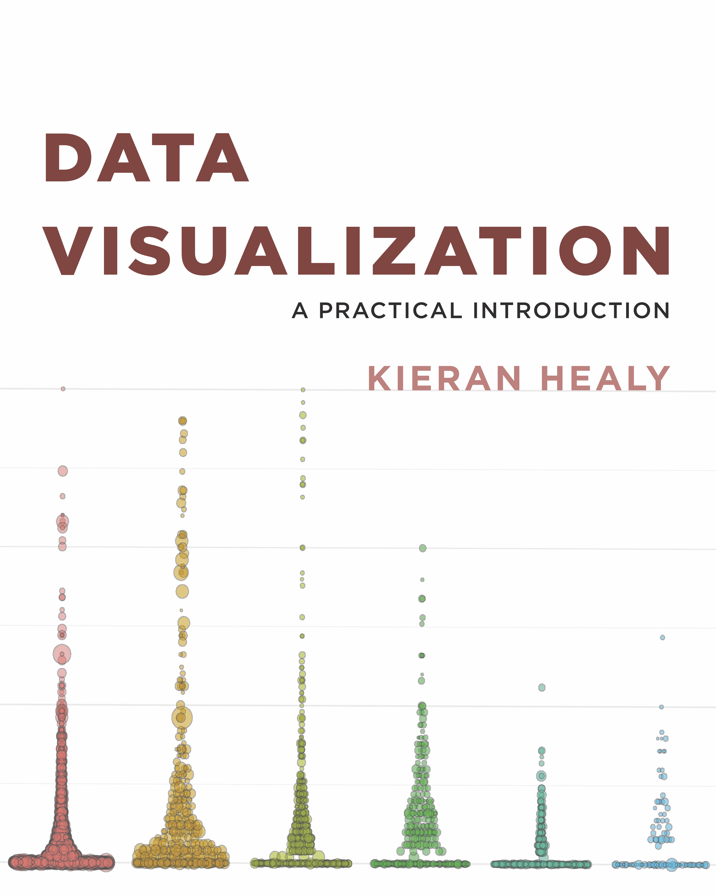
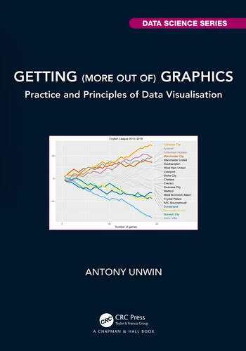
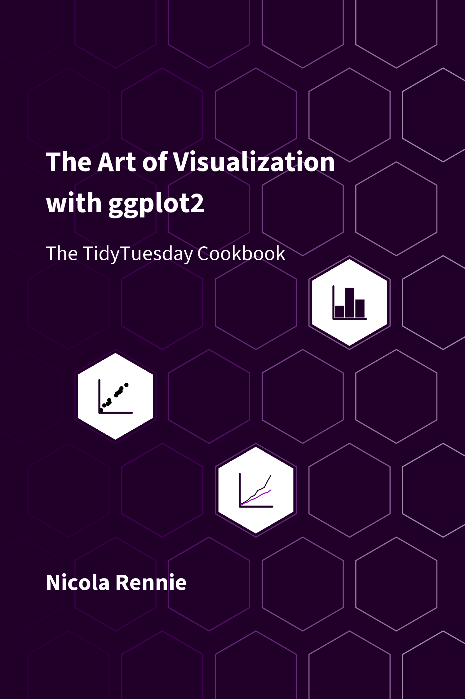
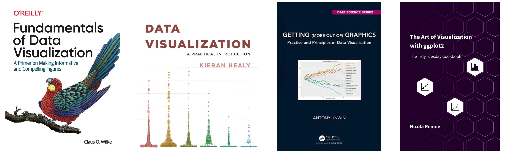
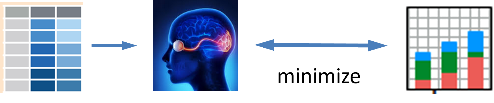

```{r include=FALSE}
source("R/common.R")
clean_pkgs()
knitr::opts_chunk$set(
  engine.opts = list(
    extra.preamble = c(
      "\\usetikzlibrary{arrows.meta, positioning}",
      "\\usepackage{smartdiagram}"
    )
  )
)
```

::: {.content-visible when-format="html"}

::: {.callout-note icon=false appearance="simple"}

Welcome to the online version of *Visualizing Multivariate Data and Models with R*. 

This book will be published by [CRC Press](https://www.routledge.com/corporate/about-us/crc-press). 

:::

:::

# Preface {.unnumbered}

<!-- **TODO**: Make this a more general introduction -->

This book is about graphical methods developed recently for multivariate data, and their uses in understanding relationships when there are several aspects to be considered together. Data visualization methods for statistical analysis are well-developed 
and widely available in R for simple linear models with a single outcome variable, as well as for more complex models with nonlinear effects, hierarchical data with observations grouped within larger units and so forth.

However, with applied research in the sciences, social and behavioral in particular, it is often the case that the phenomena of interest (e.g., depression, job satisfaction, academic achievement, childhood ADHD disorders, etc.) can be measured in several different ways or related _aspects_. Understanding how these different aspects are _related_ can be crucial
to our knowledge of the general phenomenon.

For example, if academic achievement can be measured for adolescents by reading, mathematics, science and history scores, how do predictors such as parental encouragement, school environment and socioeconomic status affect all these outcomes? In a similar way? In different ways? In such cases, much more can be understood from a multivariate approach that considers the correlations among the outcomes. Yet, sadly, researchers typically examine the outcomes one by one which often only tells part of the data story.

<!--
However, to convey the statistical and graphic methods to do these things, I begin with some warm-up exercises
in multivariate thinking, with a grand scheme for statistics and data visualization, a parable, and an example of multivariate discovery.
-->

## Overview

<!-- **TODO**: Expand this into a narrative overview of the parts and chapters. -->

The book is organized into four parts that build progressively from orienting ideas and exploratory methods through increasingly sophisticated multivariate models:

```{tikz}
%| label: fig-book-parts-code
%| eval: false
%| echo: false
\smartdiagramset{
  back arrow disabled=true,
  module minimum width=2cm,
  module minimum height=1.2cm,
  text width=1.8cm,
  module x sep=3,
  font=\small,
  set color list={blue!35, teal!40, green!35, orange!40},
}
\smartdiagram[flow diagram:horizontal]{
  Orienting\\ Ideas,
  Exploratory\\ Methods,
  Univariate\\ Models,
  Multivariate\\ Models
}
```

```{r}
#| label: fig-book-parts
#| fig-cap: "The four parts of the book as a linear progression."
#| fig-align: center
#| out-width: 95%
#| echo: false

```

* **Part 1: Orienting ideas**: Sets the stage for the book. To motivate the statistical and graphic methods described here, I begin with some warm-up exercises (@sec-prelude)
in multivariate thinking, with a grand scheme for statistics and data visualization, a parable, and an example of multivariate discovery. @sec-introduction describes the conceptual and statistical advantages of using a multivariate design to study how two or more outcome variables are related. @sec-getting_started uses a few small examples to
illustrate the often crucial role that visualization plays in understanding relations among variables.

* **Part 2: Exploratory methods**: Before fitting formal models, it is essential to view
multivariate data in various ways to try to understand the rich complexity---to see patterns, trends and
noteworthy features.
@sec-multivariate_plots covers graphical displays for seeing structure among many variables---scatterplot matrices, parallel coordinates, and related tools, where perception can be enhanced by adding visual summaries.
@sec-pca-biplot turns to dimension reduction via principal components analysis (PCA) and biplots, which project high-dimensional data onto low-dimensional views that reveal the dominant patterns.

* **Part 3: Univariate methods**: Univariate linear models, fit with `lm()`, provide a comprehensive framework for understanding how a single response depends on one or more predictors. @sec-linear-models reviews the overall framework; @sec-linear-models-plots surveys graphical methods for fitting and diagnosing these models---effect displays, added-variable plots, and influence diagnostics; @sec-lin-mod-topics addresses specialized topics in linear models; and @sec-collin closes with the problem of collinearity and its visualization through ridge regression.

* **Part 4: Multivariate methods**: This is the heart of the book. @sec-Hotelling introduces Hotelling's $T^2$---the multivariate analog of the $t$-test---as a gateway to the world of multivariate models. @sec-mlm-review develops the general multivariate linear model (MLM); @sec-vis-mlm visualizes these models through HE plots and related displays; @sec-eqcov addresses equality of covariance matrices; @sec-influence-robust covers multivariate influence diagnostics and robust alternatives; and @sec-case-studies presents some extended case studies that bring these threads together.


## Features

Some key substantive and pedagogical features of the book are:

* The writing style is purposely pedagogical (hopefully not too pedantic), in that it aims to teach **how to think** about
analysis and graphics for multivariate data. That is, I try to convey how you can achieve _understanding_ of statistical concepts
and data visualization through ways of _representing those ideas_ in diagrams and plots, and producing graphics using R functions and packages.

* To help understand the how modern statistical and graphic methods became more powerful over time,
the book takes a **historical perspective**, where it is useful to convey how the innovations we use today evolved.

* Statistical data visualization is cast in a general framework by their **goal** for communicating information, either to your self or others (such as see the _data_, visualize a _model_, diagnose _problems_), rather than a categorization by **graphic types** like bar charts and line graphs.
This is best informed by the principles and goals
of **communication**, for example making graphic comparison easy and ordering factors and variables according to what should be seen, called _effect ordering_ for data display [@FriendlyKwan:03:effect].
\ix{effect ordering}

*	Data visualization is seen as a combination of **exposure**---plotting the raw data---and **summarization**--- plotting statistical summaries---to highlight what should be noticed. For example, data ellipses and confidence ellipses are widely used as simple, effective summaries of data and fitted model parameters. When the data is complex, the idea of **visual thinning** can be used to balance the tradeoff.
\ix{visual thinning}

* The book exploits the rich connections among **statistics**, **geometry** and **data visualization**. Statistical ideas, particularly for multivariate data, can be more easily understood in terms of geometrical ones that can be seen in diagrams and data displays. More importantly, ideas from one domain can amplify what we can understand from another.

*	These graphical tools can be used to understand or explain a wide variety of statistical concepts, phenomena, and paradoxes such as Simpson's paradox (@sec-simpsons), effects of measurement error (@sec-meas-error), bias-variance tradeoff (@sec-bias-variance), and so forth.

*	The HE ("hypothesis - error") plot framework provides a simple way to understand the results of statistical tests and the relations among response outcomes in the multivariate linear model.

*	Dimension reduction techniques such as PCA and discriminant analysis are presented as "multivariate juicers", able to squeeze the important information in high-dimensional data into informative two-dimensional views. But sometimes, the most important
information for a problem lies in the smallest dimensions, as is the case in outlier detection (@sec-multivar-normality), collinearity (@sec-collin-biplots) and ridge regression (@sec-ridge-low-rank).


## What I assume

It is assumed that the reader has at least a basic background in _applied, intermediate_ statistics. This would normally
include material on simple and multiple regression as well as simple analysis of variance (ANOVA) designs.
This also means that you should be familiar with 
the basic ideas of statistical inference including hypothesis tests and confidence intervals.
<!-- **TODO**: Complete this required background -->

There will also be some mathematics in the book where words and diagrams are not enough.
The mathematical level will be intermediate, mostly consisting of simple algebra. No derivations, proofs, theorems here!

For multivariate methods, it will be useful to express ideas using **matrix notation** to simplify presentation. 
It will be enough for you to recognize that a single symbol $\mathbf{y}$ can be a shorthand for $n$ scores on a
variable like weight, and
the symbol $\mathbf{X}$ can represent an entire data table, with, say $n$ observations on $p$ variables
like height, body mass index, diet components, and so forth.
Then, the notation $\mathbf{y} = \mathbf{X} \boldsymbol{\beta}$
represents an entire linear model to relate weight to these other variables.
I'm using this math notation to express ideas, and all you will need is a _reading-level_ of understanding.

For this, the first chapter of @Fox2021, _A Mathematical Primer for Social Statistics_, is an excellent overview,
and the rest is well worth reading.
If you want to learn something of using matrix algebra for data analysis and statistics in R, I recommend
our package `r pkg("matlib", cite=TRUE)`.

## R Resources

I also assume the reader to have at least a basic familiarity with statistical analysis in R.
While R fundamentals are outside the scope of the book, I believe that this language provides a rich set of resources, far beyond that offered by other statistical software packages, and is well worth learning.
For those not familiar with R or wish to learn new skills, I recommend:

* Cotton [-@Cotton-2013], _Learning R_  ([online](http://duhi23.github.io/Analisis-de-datos/Cotton.pdf)) provides a well-rounded basic introduction to R, covering data types, lists and data frames, functions, packages and workflow for data analysis and graphics;
* Matloff[-@Matloff-2011], _The Art of R Programming_  ([online](https://diytranscriptomics.com/Reading/files/The%20Art%20of%20R%20Programming.pdf)) is devoted to learning the programming features of R. It covers all the basics (data types, arrays, data frames), R functions, object-oriented programming, debugging, and so forth.
* Wickham[-@Wickham2019], _Advanced R_  ([online](https://adv-r.hadley.nz/)) is aimed at intermediate R programmers who want to dive deeper into R and learn how things work,
* Long & Teetor [-@LongTeetor2019], _R Cookbook_ 2$^{nd}$ Ed ([online](https://rc2e.com/)) provides how-to recipies for
basic tasks from working with RStudio, to input and output, general statistics, graphics, and regression / ANOVA;
* Fox & Weisberg [-@FoxWeisberg:2018], _An R Companion to Applied Regression_  is a fantastic resource for learning
how to perform statistical analyses in R and visualize results with insightful graphics. It is the companion book
to Fox's [-@Fox:2016:ARA], _Applied Regression Analysis and Generalized Linear Models_, which I consider the 
best intermediate-level
modern treatment of these topics. I make heavy use of the accompanying `r package("car", cite=TRUE)` which provides
important and convenient graphical methods.

When you work with R, it may be useful to have this collection of [R and RStudio cheatsheets](https://friendly.github.io/6135/R/rstudio-cheat-sheets-rev3.pdf) I prepared for my graduate data visualization course.


## R graphics resources

In this book, I create a large number of graphs in R, and have aimed to present and _describe_ how I do them using
R packages and code to manipulate the data or numerical output from analysis function, so that you can learn from these
examples to apply these ideas to your own data. 

In writing this, I've also tried to exemplify graphical principles that underlie effective graphic communication.
You might find the lecture notes, extensive resources and R examples for my course, 
[_Psychology of Data Visualization_](https://friendly.github.io/6135/) useful.


In addition, there are a few books I recommend:

::: {.content-visible when-format="html"}
<center>
<a href="https://clauswilke.com/dataviz/"></a> &nbsp;&nbsp;
<a href="http://socvis.co"></a> &nbsp;&nbsp;
<a href="https://github.com/antonr4/GmooGkodes"></a> &nbsp;&nbsp;
<a href="https://nrennie.rbind.io/art-of-viz/"></a>
</center>
</br>
</br>
:::

::: {.content-visible when-format="pdf"}

```{r}
#| echo: false
#| out-width: "100%"

```

:::

* Claus Wilke [-@Wilke2019], _Fundamentals of Data Visualization_ ([online](https://clauswilke.com/dataviz/))
A well thought out presentation of important ideas of graphic presentation; it covers a wide range of topics, with good practical advice and lots of examples. How to do these in R is covered in his [course notes](https://wilkelab.org/SDS375/).

* Keiran Healy [-@Healy2019], _Data Visualization: A Practical Introduction_ ([online](http://socvis.co)).
A highly accessible, hands-on primer on how to create effective graphics from data using `r pkg("ggplot2")`,
with a focus on how to think about the information you want to show.

* Antony Unwin [-@Unwin2024], _Getting (more out of) Graphics_. This book
offers a collection of 25 case studies of interesting datasets, exemplifying desirable features of graphs use to 
understand them and using `r pkg("ggplot2")` graphics. A second part provides useful advice on graphical practice,
drawing on the lessons of the examples from the first part.
The R code for all chapters is [available online](https://github.com/antonr4/GmooGkodes).

* Nicola Rennie [-@Rennie2025], _The Art of Data Visualization with ggplot2_ ([online](https://nrennie.rbind.io/art-of-viz/)). Rennie offers a kind of master class in designing effective, attractive
graphics using `r pkg("ggplot2")`. The examples chosen stem from the weekly[Tidy Tuesday](https://github.com/rfordatascience/tidytuesday) challenges that invite graphic programmers and designers to
to work on a shared dataset to see what they can do.


<!-- **TODO**: Add more stuff on general books about graphics -->


## R coding style used here

::: {.callout-note title="Note to reviewers"}
The coding style for computing and graphics used in this book are expressed using both the traditional
functional syntax, `f(g(x))` and the newer approach using pipes (`|>`) of the tidyverse.
Similarly, I use both base R graphics and plots based on the "ggverse" of `r pkg("ggplot2")` and it's large family of add-on and extension packages.[^ggplot-ext] 

[^ggplot-ext]: The official [ggplot2 extensions gallery website](https://exts.ggplot2.tidyverse.org/gallery/), lists 151 registered extension packages available as of this writing. There is also the [ggplot2 extenders club](https://ggplot2-extenders.github.io/ggplot-extension-club/), an active group of developers organized by
Gina Reynolds and Teun van den Brand, who aim to facilitate thinking about further growth of `ggplot2` ideas
and implementations.

**TODO**: How and why it is this way should be explained to the reader.  The material below is a start, but needs a bit of fleshing out
or editing down.

<!-- Notation is all important ... -->
:::

Like natural language and the graphic methods used in this book,
R syntax and the programming style for graphics has evolved considerably since R
was first introduced by Ross Ihaka and Robert Gentleman in 1992. It was originally based on the
S programming language [@Becker-etal:88] and designed as a _functional_ language.

This means that programs are constructed by applying and composing functions. For example:
`log(x)`, `exp(x)` return a value which can be assigned to an object name, `y <- log(x)`,
or be passed to another function, as in `diff(log(x))` to get differences of adjacent values, $\log{(x_i)} - log{(x_{i-1})}$
or further, `exp(diff(log(x)))` to return those differences to the original scale of $x$.

But that functional syntax gets messy: it's hard to read and also to write your intentions in code.
 

* pipes
* tidyverse
* R graphics: `plot()` -> `ggplot()`


Rather than being dogmatic about using the newest, most politically correct style,[^skeptic]
in this book I have taken the view that what is most important about programming and graphics software is that
they serve as a route---as short and direct as possible---between **having an idea** in your head of what you
want to do, and **seeing the result** on your screen or in your report, as illustrated in @fig-idea-graph.

[^skeptic]: See Norm Matloff's essay [Tidyverse Skeptic](https://matloff.github.io/TidyverseSkeptic/Skeptic.html).
He argues that the tidyverse is not a good vehicle for teaching novice, noncoders, and that
using base-R as the vehicle of instruction brings students to a more skilled level, in shorter time.

```{r}
#| label: fig-idea-graph
#| out-width: "80%"
#| echo: false
#| fig-cap: "The expressive power of graphics software can be considered as minimizing the path from an idea in your head to finished graphic."

```


Consequently, for nearly every graph in this book, I used what I considered to be the most effective style
to produce an *admirable graphic*, but---perhaps more importantly--to be able to *describe how* I coded that to the reader.

For example, the `r package("car")` and my `r pkg("heplots")` and related packages use base-R graphics,
but I could customize their use in examples by using the conventions of `points()`, `lines()`, `text()` and
even `par()` when necessary. However, if I was starting this project anew, I would now use
`r pkg("tinyplot", cite=TRUE)`, which has removed many of the cringeworthy features of base-R graphics.

On the other hand, `r package("ggplot2")` was designed to be an _elegant_ language, based on the grammar of graphics
[@Wilkinson:99]. It allows you to _think of building plots_ logically and coherently, layer by layer. Instead of memorizing specific function calls and their arguments for every type of chart, you learn a flexible, high-level language for describing what you _want your graphic to look like_. This promotes a more structured thinking about data visualization, making it easier for you to iterate[^80-20], 
as we always do, to create beautiful, publication-quality graphics. 

[^80-20]: You should think of the "80-20" graphics rule when you work. This says you can produce 80% of your finished graphic with 20% of your total effort. But the corollary is that it takes you 80% of your time to fix the limitations of the remaining 20%.

\ix{80-20 graphics rule}

This is great in theory, but as you will see here,
in many code examples, beyond the basic `geom_*` elements, a good deal of the effort to produce them required multiple steps to (a) get my data into a tidy format, (b) assign proper `scale_*`s to data variables and (c) use `theme()` arguments to control
the large and small aspects of graphic design that contribute to the elegance and potential beauty of finished product you see.

Consequently, this book stands on the shoulders of _several_ giants in R graphics software, but the goal of reducing the gap
between the idea of a graph and the visual result can still be narrowed.


## Typographic conventions used in this book

The following typographic conventions are used in this book:

* _italic_ : indicates terms or phrases to be _emphasized_ or defined in the text; **bold** : is used for terms
to be given **strong emphasis**, particularly for their first mention.

* Package names are printed in **bold** and colored `r colorize("brown", "brown4")`, for example
  `r pkg("ggplot2")`, `r pkg("car")` and the `r package("matlib")`. These uses generate citations like
  `r pkg("ggplot2", cite = TRUE)` on their first use. Package references in the text are automatically indexed,
  individually and under a "Packages" heading.

* Datasets are rendered as their name in monospaced font, like `r dataset("Prestige", "carData")` or 
indicating the package from which they come, as in `r dataset("carData::Prestige")`. These too are automatically
indexed.

* A monospaced `typewriter` font is used in the text to refer to _variable_ and _function_ names, 
such as `education` and `plot()`. This font is also for R statement elements, keywords and code fragments as well.

* R code in program listings and output is presented in a `monospaced (typewriter)` font,
  [`fira mono`](https://fonts.google.com/specimen/Fira+Mono)

<!-- * _`fixed-width italic`_ : isn't used yet, but probably should be. -->

* For R functions in packages, I use the notation `package::function()`, such as `car::Anova()`, to identify 
that the `Anova()` function is defined in the `r pkg("car")` package. This also means you can get help on
a function by typing `?car::Anova` in the console, or a list of its arguments and default values from
`args(car::Anova)`. 

## Acknowledgements

I am profoundly grateful to my friends and colleagues John Fox, Georges Monette and Phil Chalmers
at York University who have inspired me with their insights into statistical thinking and
visualization of statistical ideas over many years. They also contributed greatly to the R
packages that help make the methods of this book accessible and easy to use.

There is also a host of graduate students I have taught, supervised and worked with over my 50+ year
career. Among these, Ernest Kwan and Matthew Sigal were important contributors to the development of
data visualization ideas and techniques reflected here. Agnieska Kopinska, Gigi Luk and Touraj Amiri
were TAs and RAs who contributed to my teaching and research. Most recently, Udi Alter and Michael Shiuming Truong worked as research assistants
and helped me in numerous ways with work on this book.

Writing this book using [Quarto](https://quarto.org/) within the RStudio (now [Posit](https://posit.co/)) development environment
presented many technical challenges I had not encountered in previous books (@FriendlyMeyer:2016:DDAR). I am grateful to Mickaël Canouil,
Christophe Dervieux, Felix Benning and others in the quarto-dev community who graciously helped me solve many issues,
and again to Michael Shiuming Truong who helped with this effort with incisive comments, suggestions and an eagle-eye to
typographic and programming details.

The book also relies heavily on the graphic ideas and software of many R developers,
including
Cory Brunson,
Vincent Arel-Bundock,
Di Cook,
John Fox,
Duncan Murdoch, who replied to issues and feature requests on their packages.
I am also indebted to Gina Reynolds, Teun van den Brand and other participants in the the [ggplot2 extenders club](https://ggplot2-extenders.github.io/ggplot-extension-club/) for help with  `ggplot()` methods I needed
for things like labeling "noteworthy" observations in plots.


<!-- ## References {.unnumbered} -->

\mainmatter
