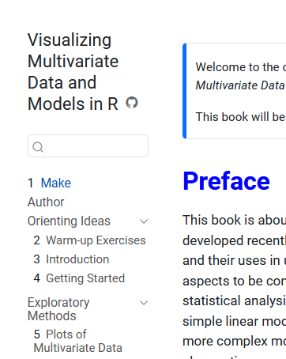

# Issue: Quarto TOC/sidebar scanner reads R code comments as chapter headings

## Summary

After adding a comment line inside an R code chunk in `index.qmd`, the book sidebar
displayed the wrong title ("Make") for that chapter and numbered it as Chapter 1,
bumping every subsequent chapter by one.

## Screenshot



## What happened

`index.qmd` starts with a hidden R setup chunk, followed later by:

```markdown
# Preface {.unnumbered}
```

After adding a comment to the setup chunk, the file looked like this:

````markdown
```{r include=FALSE}
source("R/common.R")
clean_pkgs()
# Make \usepackage{smartdiagram} available for the {tikz} book-parts diagram below.
knitr::opts_chunk$set(...)
```

...

# Preface {.unnumbered}
````

The sidebar immediately showed:

- **Chapter 1 — Make** (pointing to `index.html`)
- Chapter 2 — Warm-up Exercises  (was Chapter 1)
- Chapter 3 — Introduction  (was Chapter 2)
- … every subsequent chapter bumped by one

The page itself rendered correctly: `<h1 class="unnumbered">Preface</h1>` appeared on
the page. Only the sidebar/TOC entry was wrong.

The full "title" that Quarto extracted (visible in the `data-render-id` base64 value in
the sidebar HTML) was:

> Make \usepackage{smartdiagram} available for the {tikz} book-parts diagram below.

— which is the complete text of the R comment, without the leading `#`.

## Root cause

Quarto pre-scans each `.qmd` source file to extract chapter titles and build the sidebar
before (or independently of) running knitr. The scanner appears to search for lines
beginning with `#` without properly skipping the contents of fenced code blocks. So:

```
# Make \usepackage{smartdiagram}...   ← found first, treated as chapter heading
```

was found before:

```
# Preface {.unnumbered}               ← correct heading, found later
```

Because the comment line carried no `{.unnumbered}` attribute, the chapter was also
treated as numbered, displacing all later chapters.

## Reproduction (minimal)

In a Quarto book, create `index.qmd` with no YAML frontmatter:

````markdown
```{r include=FALSE}
# My comment here
```

# Preface {.unnumbered}

Content.
````

Render the book. The sidebar will show "My comment here" as a numbered chapter instead
of "Preface" as unnumbered.

## Fix applied

Deleted the `# Make ...` comment from the R chunk in `index.qmd`. After re-rendering,
the scanner finds `# Preface {.unnumbered}` and the sidebar is correct again.

A more robust workaround (belt-and-suspenders) is to add explicit YAML frontmatter to
`index.qmd` so Quarto never needs to scan the body for the title:

```yaml
---
title: Preface
---
```

## Questions for the Quarto discussion group

1. Is this a known limitation of Quarto's chapter-title scanner?
2. Should fenced code block content be excluded when scanning for headings?
3. Is adding `title:` to the YAML frontmatter of every chapter file the recommended
   defence, or is there a book-level setting that prevents this?
4. Is this reproducible across Quarto versions, or version-specific?

## Environment

- Quarto book project (HTML + PDF, `documentclass: krantz`)
- `index.qmd` has no YAML frontmatter (title comes from first `#` heading)
- Quarto version: check with `quarto --version`
- Discovered: 2026-05-02
