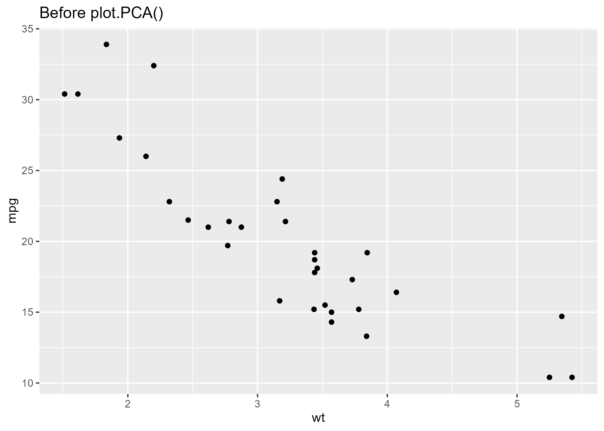
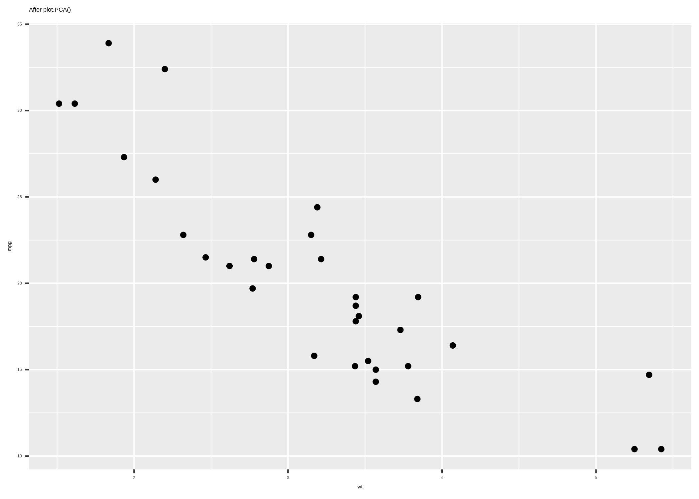

# FactoMineR GitHub issue: plot.PCA() showtext leak

**Filed**: [husson/FactoMineR#41](https://github.com/husson/FactoMineR/issues/41) (2026-09-06)

Repro images: `factominer-showtext-before.png`, `factominer-showtext-after.png`.

---

Title: plot.PCA()'s default graph.type="ggplot" silently calls showtext::showtext_auto(), globally shrinking text in ALL later plots

## Summary

I recently ran into a nasty problem with my book, [_Visualizing Multivariate Data and Models in R_](https://friendly.github.io/Vis-MLM-book/),
where **all** the biplots and other graphs suddenly appeared with font size too tiny to read.
It took me a long time to track this down to a change in `FactoMineR`, from an earlier version to  the current 2.16.

Something as nasty as this never happened with any other graphic/stats package I've
used in the book over its long development. It's going into production how, so this incident was a total shock.

I thought at first it might have been caused by a recent change in my `ggbiplot` package, but that was not the case.
My notes and diagnosis of this can be found at [ch05-ggbiplot-problems.md](https://github.com/friendly/Vis-MLM-book/edit/master/issues/ch05-ggbiplot-problems.md)

I consider this a serious BUG!

### Problem

`plot.PCA()` now defaults to `graph.type = "ggplot"`. In that mode, it applies an
internal `theme_factominer()` theme, which unconditionally calls
`showtext::showtext_auto(enable = TRUE)` as a side effect (to support the theme's
default Google Fonts).

`showtext_auto()` is not scoped to the current plot — it installs a session-wide
hook (`setHook("plot.new", ...)`, `setHook("grid.newpage", ...)`) that changes how
*all* text renders on *any* device, for the rest of the R session. It also
defaults to assuming 96 dpi. If the actual output device renders at a different
dpi (very common — 300 dpi for print/publication figures, the default in many
knitr/rmarkdown/quarto setups), every plot drawn *after* a single `plot.PCA()`
call comes out with text shrunk to roughly `96/actual_dpi` of its intended size,
while points/lines/arrows render at normal size.

This turned one diagnostic plot I made into a silent, global side effect that
corrupted **every subsequent figure** in a 2000+ line Quarto document, with no
warning pointing back to the cause.

## Reproducible example

For simplicity, I don't reproduce the troubling figures from my book. 
I just show a basic plot of the `mtcars` data before and after I generate an
unrelated biplot with `FactoMineR`.

```r
library(FactoMineR)
library(ggplot2)

data(decathlon)
res.pca <- PCA(decathlon[, 1:10], graph = FALSE)

ggplot(mtcars, aes(wt, mpg)) + geom_point() + labs(title = "Before plot.PCA()")
ggsave("before.png", width = 7, height = 5, dpi = 300)

plot(res.pca, choix = "var")   # just this call CHANGES EVERYTHING

ggplot(mtcars, aes(wt, mpg)) + geom_point() + labs(title = "After plot.PCA()")
ggsave("after.png", width = 7, height = 5, dpi = 300)   # ...shrinks this
```

`before.png` has normal text; `after.png`'s title/axis text comes out at roughly
a third the size, identical point geometry:

**Before:**


**After:**


Confirmed directly via `getHook("plot.new")`/`getHook("grid.newpage")` that a
`showtext_hook` entry appears only after the `plot.PCA()` call and persists
indefinitely.

## My fix

Without waiting on a fix in FactoMineR itself, I worked around this in my own book by
passing `graph.type = "classic"` to every `plot.PCA()` call:

```r
plot(res.pca, choix = "var", graph.type = "classic")
```

This skips the `theme_factominer()`/`showtext_auto()` code path entirely (it's only
invoked when `graph.type == "ggplot"`), so nothing in the session gets touched. As a
bonus, it also avoids depending on downloading Google Fonts, and matches the plain
base-R appearance my figures already had before FactoMineR switched its default.

## Suggested fix

Scope the `showtext_auto()` call to just this function's own plotting rather
than leaving it globally enabled:

```r
if (graph.type == "ggplot") {
  showtext_was_enabled <- showtext::showtext_auto()
  on.exit(showtext::showtext_auto(enable = showtext_was_enabled), add = TRUE)
  ...
}
```

Or more conservatively: only enable it if not already active, and don't assume
96 dpi — respect an existing `showtext::showtext_opts(dpi=...)` or read the
current device's actual dpi.

## Session info
```
R 4.6.1, FactoMineR 2.16, ggplot2 4.0.3, showtext 0.9.8, sysfonts 0.8.9
```
